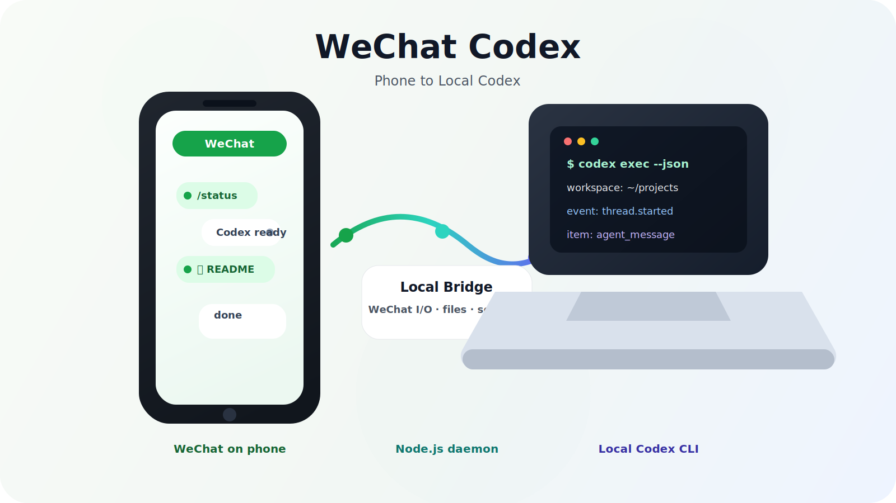

# WeChat Codex

把手机微信变成你电脑上 Codex 的远程入口。

你在微信里发消息，家里的 Mac 负责接收、调用本机 `codex exec --json`、再把结果发回微信。代码、文件、账号凭证都留在本机；手机只是一个轻量遥控器。

[English](README_en.md)



## 现在能做什么

| 能力 | 说明 |
|------|------|
| 微信扫码绑定 | 扫码后微信里会出现一个可对话的 bot |
| 调用本机 Codex | 后台进程把微信消息转成 `codex exec --json` 请求 |
| 工作目录可切换 | 用 `/cwd` 指定 Codex 处理哪个项目 |
| 支持图片和文件 | 图片/文件会下载到本机临时目录，再交给 Codex 分析 |
| 文件回传 | Codex 回复里出现本地文件路径时，可自动推送常见文件类型到微信 |
| 后台守护 | macOS 用 launchd 托管，支持开机自启和崩溃重启 |
| 会话管理 | 支持 `/clear`、`/compact`、`/history`、`/undo`、`/stop` |

## 工作方式

```text
手机微信
   │
   │  文本 / 图片 / 文件
   ▼
ilink Bot API
   │
   │  长轮询收消息，HTTP 发回复
   ▼
Node.js bridge
   │
   │  spawn 本机 Codex CLI
   ▼
codex exec --json
   │
   │  读写本机项目文件
   ▼
你的电脑工作区
```

桥接层不替 Codex 做推理，也不把项目上传到第三方服务。它只负责微信收发、文件中转、会话状态和守护进程。

## 快速开始

### 1. 准备环境

需要：

- macOS 或 Linux
- 个人微信账号
- Codex CLI 已登录，`codex doctor` 可通过
- Node.js 18+

当前仓库里已经放了一个本地 Node 运行时到 `.local-node/`，如果系统没有 Node，可以先这样进入环境：

```bash
cd /Users/xiao/projects/wechatcodex
export PATH=/Users/xiao/projects/wechatcodex/.local-node/bin:$PATH
```

### 2. 安装依赖

```bash
cd /Users/xiao/projects/wechatcodex
npm install
```

### 3. 扫码绑定微信

```bash
npm run setup
```

终端会打开或输出二维码图片。用微信扫码并确认后，会生成账号凭证到：

```text
~/.wechat-codex/accounts/
```

### 4. 启动后台服务

```bash
npm run daemon -- start
npm run daemon -- status
```

macOS 会注册 launchd 服务，后续可直接后台运行。

## 常用命令

### 本机管理

```bash
npm run daemon -- status    # 查看状态
npm run daemon -- logs      # 查看日志
npm run daemon -- restart   # 重启服务
npm run daemon -- stop      # 停止服务
```

### 微信里发送

| 命令 | 作用 |
|------|------|
| `/help` | 查看帮助 |
| `/status` | 查看当前工作目录、模型、会话状态 |
| `/cwd <路径>` | 切换 Codex 工作目录 |
| `/model <名称>` | 切换 Codex 模型 |
| `/prompt <内容>` | 设置系统提示词 |
| `/clear` | 清除当前会话 |
| `/compact` | 开启新的 Codex 会话，保留聊天历史 |
| `/history [数量]` | 查看最近聊天记录 |
| `/undo [数量]` | 撤销最近几条历史 |
| `/stop` | 停止当前任务 |
| `/send <路径>` | 从电脑发送本地文件到微信 |

## 数据目录

```text
~/.wechat-codex/
├── accounts/       # 微信账号凭证
├── config.json     # 默认工作目录、模型、系统提示词
├── sessions/       # 会话状态和聊天历史
├── pending/        # 因微信限流暂存的待发送内容
└── logs/           # bridge-YYYY-MM-DD.log、stdout/stderr
```

这些文件只在本机。不要把 `~/.wechat-codex/accounts/` 上传到任何仓库。

## Codex 可执行文件

如果后台服务找不到 `codex`，设置 `CODEX_BIN`：

```bash
export CODEX_BIN=/Applications/Codex.app/Contents/Resources/codex
npm run daemon -- restart
```

守护脚本默认已经把这个目录加入 PATH：

```text
/Applications/Codex.app/Contents/Resources
```

## 验证

```bash
npm run build
npm test
```

也可以直接在微信里发：

```text
/status
```

或：

```text
看一下当前工作目录下有哪些项目
```

如果日志里能看到 `Starting Codex CLI query` 和 `Text message sent`，说明链路已经通了。

## 说明

这个项目的第一版目标很朴素：让手机稳定连到本机 Codex。它保留了微信收发、文件处理、队列和守护进程能力，把原来的 Claude CLI 后端替换成 Codex CLI。
